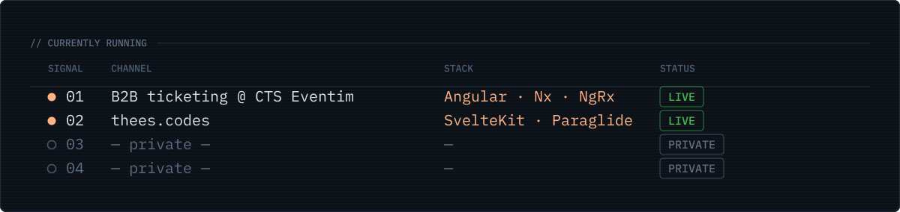

Moin. I'm **Thees**, a Senior Software Engineer from Varel on the German North Sea
coast. Full-stack background, at home in the frontend. In the trade since 2018 —
started as a teenager, poking at HTML.

Right now I'm replacing a fleet of legacy Windows clients with one modern Angular
web app at CTS Eventim in Bremen. I co-own the frontend architecture: micro
frontends with Module Federation in an Nx monorepo, plus the shared B2B design
system documented in Storybook. WCAG 2.2 AA and Core Web Vitals are review
criteria, not extras.

Nothing to clone here — my repos are private. Happy to talk about the work anyway:
[thees.codes](https://thees.codes) · [moin@thees.codes](mailto:moin@thees.codes) · [LinkedIn](https://linkedin.com/in/thees-hengstermann) · [Bluesky](https://bsky.app/profile/thees.codes)
